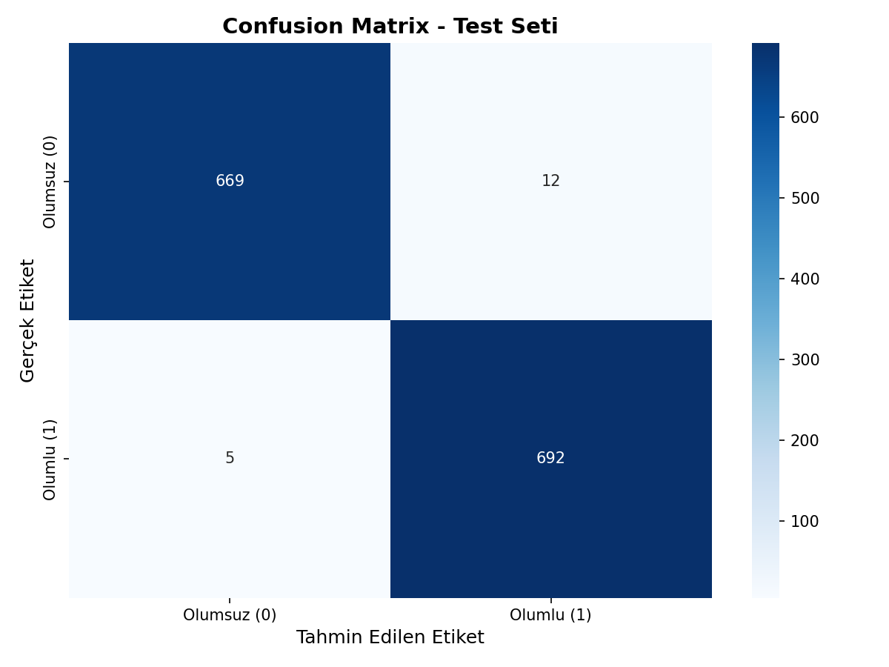
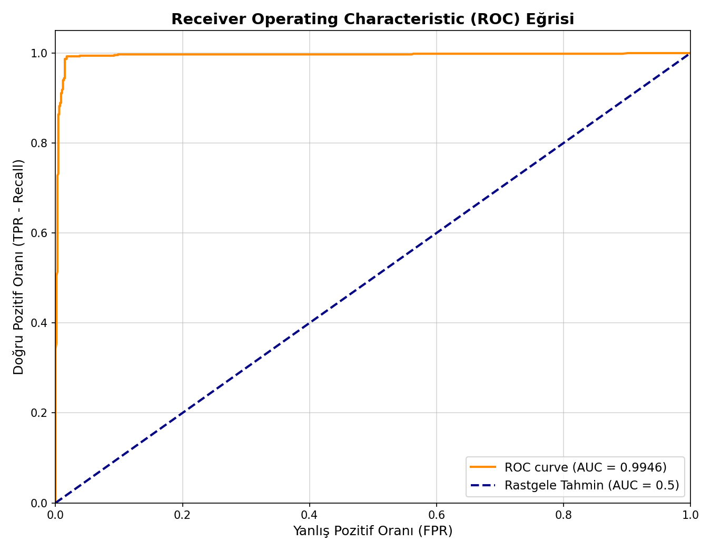
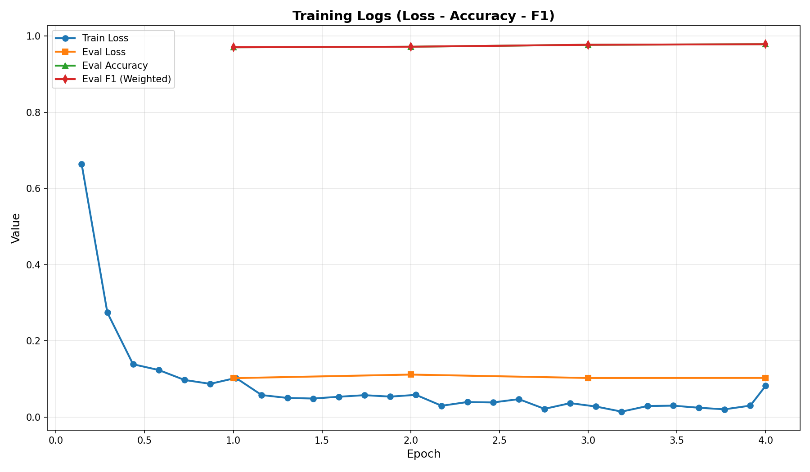

# E-Ticaret Ürün Yorumları Duygu Analizi ve Web API Entegrasyonu


<a id="türkçe"></a>

Bu proje, e-ticaret sitelerinden elde edilen Türkçe müşteri yorumlarını Doğal Dil İşleme (NLP) yöntemleriyle analiz ederek **olumlu** veya **olumsuz** olarak sınıflandırmayı amaçlayan bir tez projesidir.

## 📌 Proje Hakkında
Bu çalışmada, derin öğrenme tabanlı Doğal Dil İşleme (NLP) yöntemleri kullanılarak API destekli bir duygu analizi (sentiment analysis) sistemi geliştirilmiştir. Projenin çekirdeğini Transformer mimarisi (BERT tabanlı modeller) oluşturmaktadır.
Proje geliştirme sürecinde çeşitli dil modelleri (farklı BERT varyasyonları) ve farklı batch size kombinasyonları ile hiperparametre kombinasyonları ile deneyler yapılmıştır. Elde edilen sonuçlar karşılaştırılarak, **en yüksek F1 skoru oranını veren** model mimarisi seçilmiş ve canlı sisteme (API) entegre edilmiştir.

**📈 Model Başarısı ve Yeniden Üretilebilirlik (Reproducibility) Notu:**
Bu resmi tez çalışması kapsamında optimize edilen en iyi model **%98.77** F1-Skorunu ulaşmıştır.

## 📊 Veri Seti (Dataset)
Projede kullanılan veri seti Kaggle üzerinde yayınlanmıştır. Veri setine buradan ulaşabilirsiniz:
🔗 **(https://www.kaggle.com/datasets/mujdatcabuk/eticaret-urun-yorumlari)**

## 🚀 Özellikler
- **Veri Ön İşleme:** HTML etiketleri, URL'ler, e-posta adresleri temizlenir ve tekrarlayan harfler (örneğin "çooook" -> "çook") NLP'ye uygun şekilde normalize edilir.
- **Veri Seti Yönetimi:** Veri setindeki olumlu/olumsuz sınıf eşitsizliklerini gidermek için ağırlıklandırma (Class Weighting) yöntemi kullanılmıştır.
- **Modüler Mimari:** Veri yükleme, metin temizleme, model eğitimi ve API servis işlemleri farklı modüllere ayrılmıştır.
- **Kapsamlı Değerlendirme:** ROC Eğrisi, Confusion Matrix, Sınıflandırma Raporları ile modelin performansı detaylıca incelenir.
- **REST API Desteği:** `FastAPI` kullanılarak geliştirilen servis, tekli veya çoklu (batch) tahmin isteklerine yanıt verebilecek şekilde tasarlanmıştır.

## 📂 Proje Yapısı
```text
.
├── src/
│   ├── data_loader.py        # Veri setini yükleme ve formatlama
│   ├── data_preprocessing.py # Metin temizleme ve sınıf dengesizliği hesaplamaları
│   └── utils.py              # Eğitim loglama callback'leri ve rastgelelik sabitleyiciler
├── main.py                   # Modelin ana eğitim betiği
├── api_service.py            # Eğitilen modelin sunulduğu FastAPI servisi
├── requirements.txt          # Gerekli Python kütüphaneleri
└── README.md                 # Proje tanıtım dosyası
```

## 🛠️ Kurulum
Projeyi kendi bilgisayarınızda çalıştırmak için aşağıdaki adımları izleyebilirsiniz. Bir sanal ortam (virtual environment) kullanmanız önerilir:

```bash
# 1. Depoyu bilgisayarınıza klonlayın
git clone <repo_url>
cd <repo_klasoru>

# 2. Sanal ortam oluşturun ve aktifleştirin (Windows için)
python -m venv venv
venv\Scripts\activate

# 3. Gerekli kütüphaneleri yükleyin
pip install -r requirements.txt
```

## 🧠 Model Eğitimi (Training)
Eğitim işlemini başlatmak için veri setinizin yolunu belirterek aşağıdaki komutu çalıştırabilirsiniz. Model eğitim bitiminde performans grafiklerini ve sonuç raporlarını otomatik oluşturacaktır.

```bash
python train.py --data_csv "e-ticaret_urun_yorumlari.csv" --epochs 4 --batch_size 64 --lr 2e-5
```

## 📊 Model Başarısı ve Değerlendirme (Evaluation)
Proje geliştirme sürecinde farklı BERT varyasyonları ve dil modelleri test edilmiş; bu modeller arasından en yüksek F1-skorunu sağlayan ConvBERTurk mimarisi nihai model olarak seçilmiştir. Yürütülen bu tez çalışması kapsamında optimize edilen model, %98.77 F1-Skoruna ulaşmıştır.

⚠️ Önemli Not: Eğitilen ConvBERTurk modeli, GitHub'ın dosya boyutu sınırlandırmaları nedeniyle bu depoya doğrudan yüklenememiştir. Bunun yerine, modelin başarı metrikleri ve sınıflandırma performansını gösteren analiz grafikleri plots/ klasörü altında paylaşılmış ve aşağıda listelenmiştir.

📈 Performans ve Eğitim Grafikleri

Karmaşıklık Matrisi (Confusion Matrix): Modelin olumlu ve olumsuz yorumları tahmin ederken sergilediği başarıyı ve sınıflar arasındaki doğru/yanlış dağılımını gösterir. 

ROC Eğrisi (ROC Curve): Modelin sınıfları ayırt etme gücünü ve genel sınıflandırma performansını temsil eder. 

Eğitim Süreci: Modelin her epoch (adım) bazında kayıp (loss) ve doğruluk (accuracy) değerlerindeki değişimi ve gelişim trendini gösterir. 

## 🌐 API Kullanımı (Serving)
Eğittiğiniz en iyi modeli canlıya almak için FastAPI sunucusunu aşağıdaki komutla başlatın:

```bash
python -m uvicorn api_service:app --host 0.0.0.0 --port 8000 --reload
```
Sunucu çalıştıktan sonra tarayıcınızda `http://localhost:8000/docs` adresine giderek API'yi anında test edebilirsiniz.

## 📝 Teşekkür & Referans
Bu çalışma bir lisans tez projesi kapsamında **[Edanur Terzi]** ve **[Melike Karaman]** tarafından ortaklaşa geliştirilmiş olup, doğal dil işleme (NLP) alanında Türkçe metinlerin sınıflandırılmasına yönelik deneysel bulgular içermektedir.
